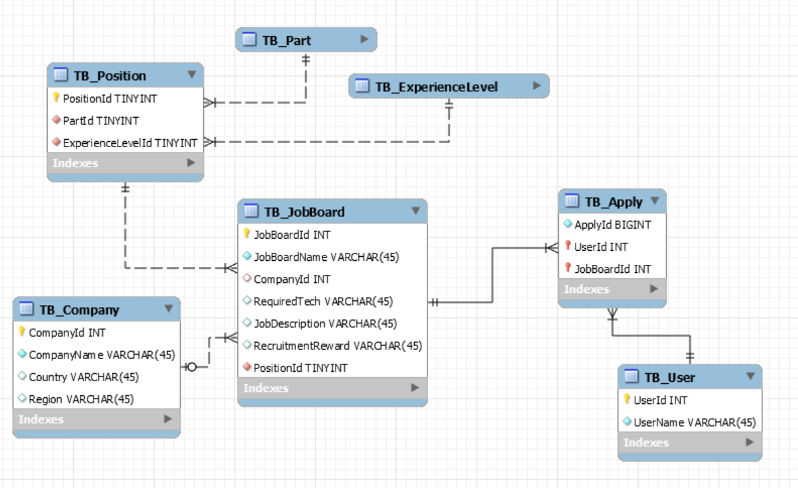

# wanted-pre-onboarding-backend

#### 🔍 목차
- [요구사항 분석](#요구사항-분석)
  * [구현할 기능](#-구현할-기능)
  * [필수 기술요건](#-필수-기술요건)
- [구현 과정](#구현-과정)
  * [ERD](#-erd)
  * [API 명세서](#-api-명세서)

---

## 요구사항 분석

### - 구현할 기능

- [x] **채용공고 등록 기능**
  - 회사는 채용공고를 등록할 수 있다.

- [x] **채용공고 수정 기능**
  - 회사는 채용공고를 수정할 수 있다.

- [x] **채용공고 삭제 기능**
  - 채용공고는 DB에서 삭제될 수 있다.

- [x] **채용공고 목록 조회 기능**
  - 사용자는 채용공고 목록을 확인할 수 있다.
  - [x] 채용공고 검색 기능(선택사항 및 가산점 요소 포함).

- [x] **채용 상세 페이지 조회 기능**
  - 사용자는 채용 상세 페이지를 확인할 수 있다.
  - [x] 해당 회사가 올린 다른 채용공고 포함(선택사항 및 가산점 요소 포함).

- [x] **채용공고 지원 기능(선택사항 및 가산점요소)**
  - 사용자는 채용공고에 지원할 수 있다.
  - 사용자는 1회만 지원 가능하다.

### - 필수 기술요건
- [x] ORM 사용하여 구현.(Sequelize 사용)
- [x] RDBMS 사용.(MySQL 사용)

## 구현 과정
### - ERD

#### 1. TB_Position의 PartId와 ExperienceLevelId의 관계 설정

- `TB_Position` 테이블에서 `PartId`와 `ExperienceLevelId`를 외래 키로 설정하고 이를 참조하기 위해 `TB_Part` 테이블과 `TB_ExperienceLevel` 테이블을 각각 생성.
- 테이블 생성 후 도메인에 해당하는 레코드를 미리 넣었음.
  - `TB_Part`:  `FE`, `BE`, `AI`, `etc`
  - `TB_ExperienceLevel`: `rookie`, `junior`, `senior`

##### 이유:
- `Part`와 `ExperienceLevel`은 각각 도메인이 명확히 정해져 있음.
- 이러한 방식을 통해 유지 보수를 용이하게 하고, 잘못된 입력이나 오타를 사전에 방지.
  
#### 2. TB_Apply 테이블의 도입
- 사용자가 채용공고에 지원하는 기능을 위한 `TB_Apply` 테이블 생성.
- `TB_Apply`의 PK로 `userId`, `jobBoardId`를 사용.
  - 하지만, SQL 쿼리 작성을 고려하여 `applyId`라는 보조키 추가 도입.

##### 이유:
- 사용자의 채용공고 지원 상태를 효과적으로 관리.
- 쿼리 최적화와 관련된 고려 사항 반영.

### - API 명세서

[API Documentation](https://documenter.getpostman.com/view/25690003/2s9YR3dbDy)
